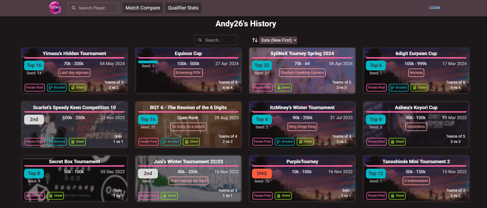

# Oth!
I am participating in a game that runs multiple tournaments a year, and we use Google Sheets to record and display the tournaments we have completed.

With this application, I aim to create an improved method for adding and presenting tournament information in a more professional manner.

Application: [Oth!](https://osu-th.vercel.app/#/history/3191010)



### Cloud services
- Auth0
  
### Frontend vite 
```bash
npm install
npm run dev
```


### .env files
```bash
VITE_AUTH_DOMAIN=AuthDomainHere
VITE_AUTH_CLIENT_ID=ClienIDHere
```
